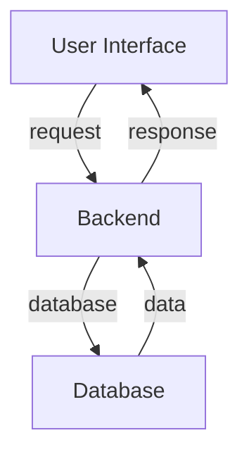

# Project Overview
The Witter project is a social media platform that allows users to create posts, follow friends, and interact with their community.

# Key Features
* User authentication and authorization
* Post creation and management
* Friend list management
* User profile management

# Architecture
The Witter project uses a client-server architecture, with a React-based frontend and a Node.js-based backend.

# Project Structure
The project is divided into two main directories: `client` and `server`. The `client` directory contains the React frontend code, while the `server` directory contains the Node.js backend code.

# Tech Stack
* Frontend: React, Redux, React Router
* Backend: Node.js, Express.js, Mongoose
* Database: MongoDB

# Main Components
* `client/src/main.jsx`: The main entry point of the React application
* `server/index.js`: The main entry point of the Node.js application
* `client/src/components/FlexBetween.jsx`: A reusable UI component
* `server/controllers/posts.js`: Handles post-related operations

# Installation
To install the project, run `npm install` in the root directory, then `npm run dev` to start the development server.

# Configuration
Environment variables are stored in a `.env` file in the root directory.

# Usage
To use the application, navigate to `http://localhost:3000` in your web browser.

# Workflow
The application workflow involves the following steps:
1. User authentication
2. Post creation and management
3. Friend list management
4. User profile management

# Architecture Overview
The Witter project uses a client-server architecture, with a React-based frontend and a Node.js-based backend.

# High-Level Design
The application is divided into two main components: the client and the server.

# Project Structure
The project is divided into two main directories: `client` and `server`.

# Execution Flow
The execution flow involves the following steps:
1. User interacts with the UI
2. UI sends a request to the backend
3. Backend processes the request and interacts with the database
4. Backend sends a response to the UI
5. UI updates based on the response

# Data Flow
The data flow involves the following steps:
1. User inputs data into the UI
2. UI sends the data to the backend
3. Backend processes the data and stores it in the database
4. Backend retrieves data from the database
5. Backend sends the data to the UI

# Module Relationships
The main modules are:
* `client/src/main.jsx`: The main entry point of the React application
* `server/index.js`: The main entry point of the Node.js application
* `client/src/components/FlexBetween.jsx`: A reusable UI component
* `server/controllers/posts.js`: Handles post-related operations
